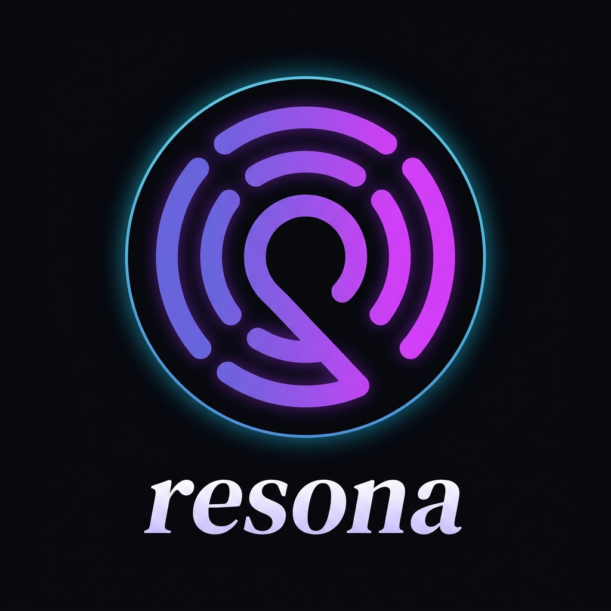

<p align="center">
  
</p>

<h1 align="center">Resona</h1>

<p align="center">
  <strong>A premium, open-source music super-app</strong><br/>
  YouTube Music · Spotify Sync · Offline Downloads · Synced Lyrics · Per-Song Atmosphere
</p>

<p align="center">
  
  
  
  
  
</p>

---

## ✨ What is Resona?

Resona is a music super-app that unifies **YouTube Music**, **Spotify**, and **local audio** into one beautiful, premium shell. Inspired by Gemini-style ambient aesthetics, Material You colour extraction, and Apple Music-quality lyric sync.

> Every song gives the entire app a unique color DNA — background, glows, controls, mini-player — all shift to match the album's dominant Pantone palette.

---

## 🎵 Features

### Core Player
- **Vinyl Spin Animation** — rotating disc with spring-back on pause, inner groove rings
- **Per-Song Pantone Atmosphere** — 10 curated palettes assigned per album art, entire app recolors
- **Gapless Playback** — pre-buffers next track at 80% progress via InnerTube
- **Skia Audio Visualizer** — FFT-driven GPU-accelerated EQ bars (React Native Skia)
- **Background Audio** — lock screen controls, notification player (react-native-track-player)

### Lyrics
- **Synced Lyrics** — LRC-format line-by-line karaoke scroll (LRCLib → Kugou fallback)
- **Word-Level Highlight** — Apple Music-style per-word gradient glow on active line
- **Tap-to-Seek** — tap any lyric line to jump to that timestamp
- **Offline Lyrics Cache** — SQLite FTS4 indexed for fast local search
- **Lyric Recall Search** — "find song by lyric fragment" using FTS4 full-text search

### Integrations
- **YouTube Music** — streaming via InnerTube API, search, playlists, history
- **Spotify Sync** — OAuth2 PKCE, pull liked songs + playlists + audio features (BPM/energy/valence)
- **ISRC Cross-Reference** — maps Spotify tracks → YouTube equivalents via ISRC + Sørensen-Dice fuzzy matching
- **Google OAuth2** — YouTube Music library access

### Offline & Downloads
- **Downloads Screen** — animated progress bars, quality picker, storage stats
- **Quality Options** — 128k AAC / 320k MP3 / FLAC lossless
- **BullMQ + FFmpeg** — background download queue with audio transcoding
- **Storage Dashboard** — used/available space, per-file management

### Smart Features
- **Sleep Timer** — elegant volume fade (30s ramp → 4s final fade), checks real playback state
- **Mood Auto-DJ** (Phase 5) — Spotify audio features → contextual auto-queue

---

## 🏗️ Architecture

```
resona/
├── src/
│   ├── screens/           # NowPlaying, Lyrics, Home, Search, Library, Downloads, Settings
│   ├── components/
│   │   ├── player/        # AudioVisualizer (Skia)
│   │   └── lyrics/        # SyncedLyricsList (word-level highlight)
│   ├── services/
│   │   ├── youtube/       # InnerTubeClient, ResolvingDataSource
│   │   ├── spotify/       # SpotifyClient (Web API)
│   │   ├── auth/          # GoogleAuth, SpotifyAuth (PKCE)
│   │   ├── lyrics/        # LyricsClient, LrcParser, LyricSearch (FTS4)
│   │   ├── sync/          # ISRCResolver
│   │   └── theme/         # PaletteExtractor, ColorExtractor
│   ├── stores/            # Zustand: usePlaybackStore, useDownloadStore, useThemeStore, useSleepTimerStore
│   ├── db/                # SQLite client with FTS4, downloads, spotify_sync schema
│   ├── navigation/        # AppNavigator (bottom tabs + slide-up player)
│   ├── theme/             # colors.ts (Pantone palette), typography.ts
│   └── config.ts          # Central constants (keys, endpoints, quality presets)
│
└── backend/               # Node.js + Fastify
    ├── server.ts          # API: /stream, /search, /download, /search-isrc
    └── workers/
        └── downloadWorker.ts  # BullMQ + FFmpeg transcoding pipeline
```

---

## 🚀 Getting Started

### Prerequisites
- Node.js 20+
- [Expo CLI](https://docs.expo.dev/get-started/installation/)
- Redis (for download queue)
- FFmpeg (for audio transcoding)

### Mobile App

```bash
git clone https://github.com/nikhil/resona.git
cd resona

npm install
npx expo install expo-file-system expo-web-browser expo-auth-session expo-crypto

npx expo start
```

### Backend

```bash
cd backend
npm install
cp .env.example .env   # Fill in your keys
npm run dev
```

### Environment Variables

Create `backend/.env`:

```env
SPOTIFY_CLIENT_ID=your_spotify_client_id
SPOTIFY_REDIRECT_URI=your_redirect_uri
REDIS_URL=redis://localhost:6379
BACKEND_PORT=3000
```

---

## 🎨 Design System

| Token | Value | Usage |
|-------|-------|-------|
| `obsidian` | `#0a0a0f` | App background |
| `deepNavy` | `#1a1a26` | Surfaces, cards |
| `mediumSlate` | `#7B68EE` | Primary accent |
| `ultraViolet` | `#E040FB` | Secondary accent |
| `crystalBlue` | `#00BCD4` | Tertiary accent |
| `paleViolet` | `#c4b8ff` | Muted text |

**Typography:** DM Serif Display (song titles) + DM Sans (UI) + JetBrains Mono (timestamps)

**Animations:** React Native Reanimated 3 (120fps UI thread), Skia Canvas (GPU visualizer)

---

## 🗺️ Roadmap

| Phase | Status | Feature |
|-------|--------|---------|
| 1 | ✅ Done | Core Player — vinyl spin, ambient visualizer, gapless playback |
| 2 | ✅ Done | Lyrics Engine — synced scroll, word highlight, tap-to-seek, offline cache |
| 3 | ✅ Done | YouTube Music Sync — InnerTube streaming, Google OAuth2, playlists |
| 4 | ✅ Done | Spotify Sync + Download Manager — PKCE, ISRC resolver, FFmpeg pipeline |
| 4.5 | ✅ Done | Pantone Atmosphere, Sleep Timer, Lyric Recall Search, Downloads Screen |
| 5 | 🔵 Next | AI Layer — Mood Auto-DJ, Smart Playlists, Last.fm Scrobbling |
| 6 | 🔵 Future | Polish — Haptics, Widgets, App Store submission |

---

## 🔑 API Keys Required

| Service | Purpose | Cost |
|---------|---------|------|
| [Spotify Web API](https://developer.spotify.com/dashboard) | Library sync, audio features | Free |
| [Google Cloud](https://console.cloud.google.com) | YouTube Data API v3 | Free tier |
| LRCLib | Synced lyrics | Free, no key |
| Genius API | Lyric annotations | Free tier |

---

## 📄 License

MIT — see [LICENSE](./LICENSE)

---

<p align="center">
  Built with ❤️ using Expo · React Native · Skia · Reanimated 3 · Fastify · BullMQ
</p>
